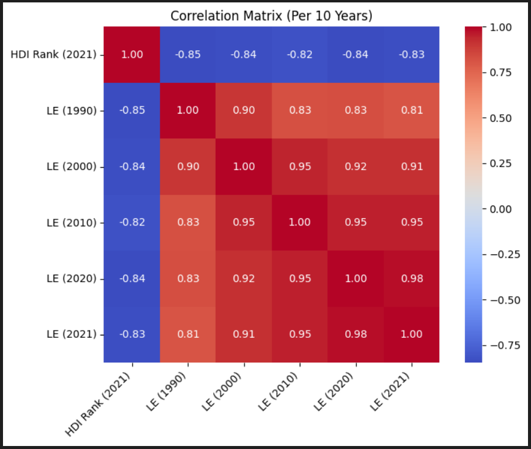
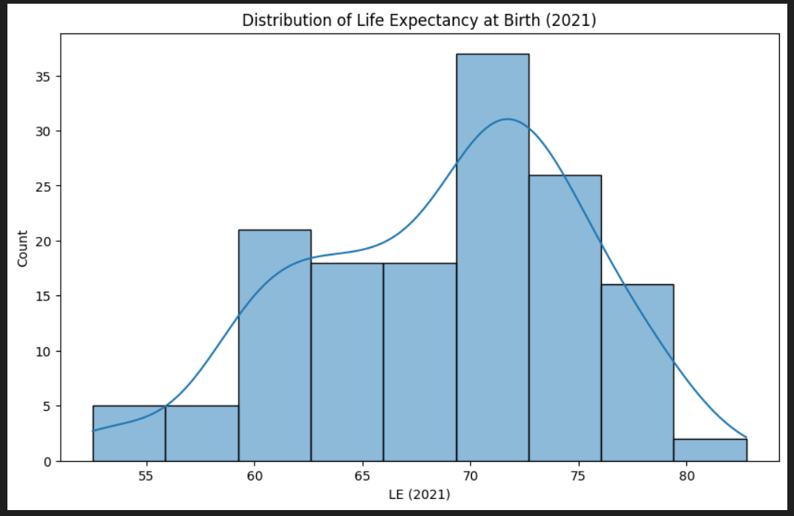

# LIFE EXPECTANCY PREDICTION APPLICATION
======================================

## Mission Statement
-----------------
To leverage historical data and machine learning to forecast life expectancy, providing valuable insights for public health planning, policy-making, and global development analysis.

## Reason for the App
------------------

This project focuses on predicting future life expectancy based on key developmental indicators. The prediction is based on factors such as the Human Development Index (HDI) Rank and historical life expectancy data from previous decades (1990, 2000, 2010, 2020). The goal is to provide a tool that can offer quick insights into a country's health trajectory, which is crucial for understanding the impact of long-term health and development policies.

The data was sourced from a public dataset on Kaggle, which you can find here: [Life Expectancy at Birth](https://www.kaggle.com/datasets/iamsouravbanerjee/life-expectancy-at-birth-across-the-globe). The model was trained using the most relevant features that showed a strong correlation with the target variable, which is the life expectancy for the year 2021.

Below are some visualizations showing the relationships between the features used for the model:





## API Endpoint
------------

This API provides life expectancy predictions using a trained Linear Regression model. The best-performing model has been deployed as a REST API.

### API URL
You can access the prediction API at the following public URL:

`https://linear-regression-model-eyk5.onrender.com/`

**Method:** `POST`

**Request Body (JSON):**
```json
{
    "hdi_rank": float,  
    "le_1990": float,
    "le_2000": float,
    "le_2010": float,
    "le_2020": float
}
```

**Response (JSON):**
```json
{
  "predicted_life_expectancy_2021": float
}
```

### Swagger UI for Testing
You can test the API using the interactive Swagger UI by visiting the following link:

[https://linear-regression-model-eyk5.onrender.com/docs](https://linear-regression-model-eyk5.onrender.com/docs)

Swagger UI provides an interface for sending requests directly to the API and viewing the live responses.

## Mobile App
-----------

A Flutter-based mobile app has been developed to provide a user-friendly interface for interacting with the prediction API in real-time.

### Instructions to Run the Mobile App
1.  **Clone the repository:**
    ```bash
    git clone https://github.com/your-username/your-repo-name.git
    ```

2.  **Navigate to the project folder:**
    ```bash
    cd your-repo-name/flutter_app
    ```

3.  **Install Flutter dependencies:**
    ```bash
    flutter pub get
    ```

4.  **Run the app:** Connect an emulator or a physical device, then run:
    ```bash
    flutter run
    ```

The app will start, and you can input values for the following features to get a life expectancy prediction:

*   **HDI Rank:** The Human Development Index rank of the country (e.g., 1 to 200).
*   **Life Expectancy 1990:** The average life expectancy in the year 1990.
*   **Life Expectancy 2000:** The average life expectancy in the year 2000.
*   **Life Expectancy 2010:** The average life expectancy in the year 2010.
*   **Life Expectancy 2020:** The average life expectancy in the year 2020.

Once you input valid values and press the "PREDICT" button, the app will display the predicted life expectancy for 2021.

## YouTube Demo
----------------
You can watch a demo of the mobile app and how it interacts with the API here:

`[https://youtu.be/vSFQojWoAYg]`

## Technologies Used
-------------------
*   **API:** FastAPI, Python
*   **Machine Learning:** Scikit-learn, Linear Regression
*   **Mobile App:** Flutter
*   **API Deployment:** Render
*   **API Documentation:** Swagger UI
